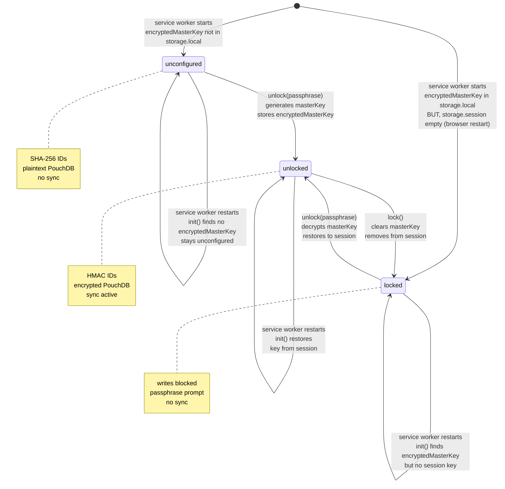
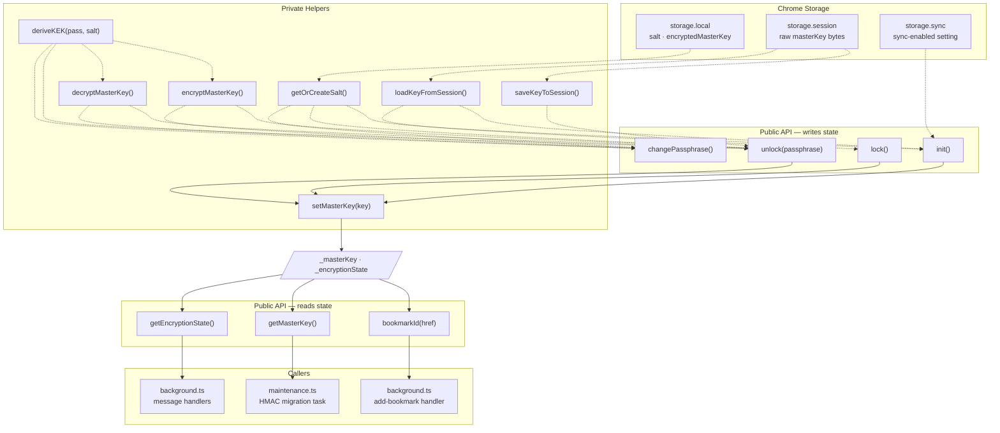
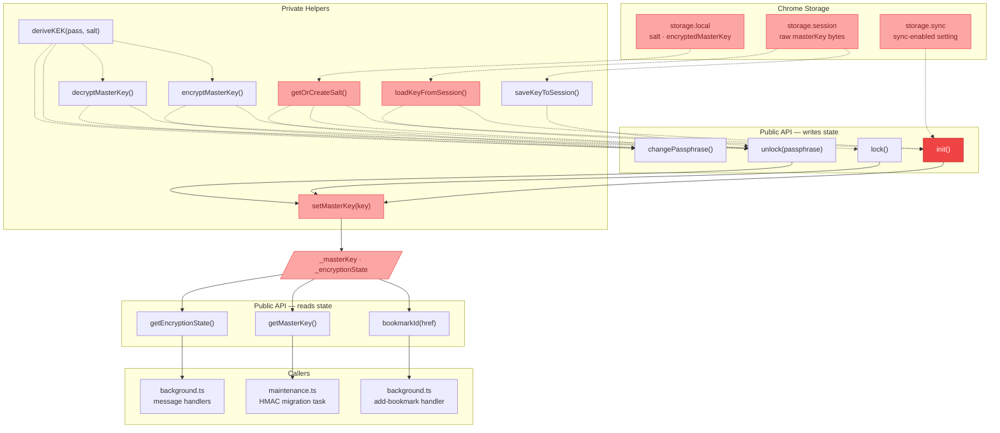
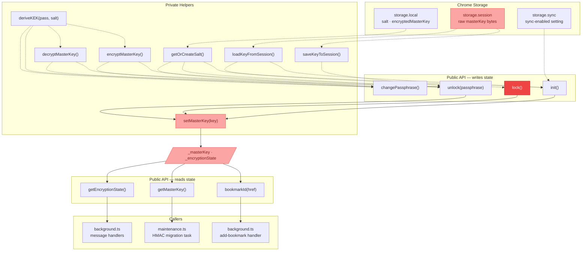
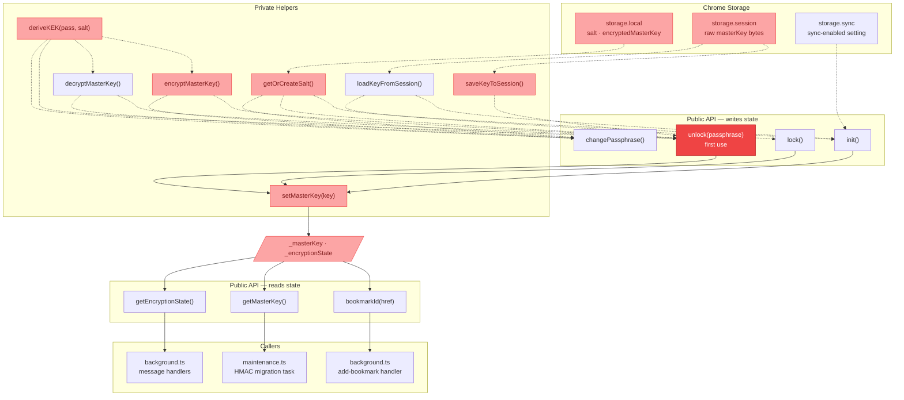
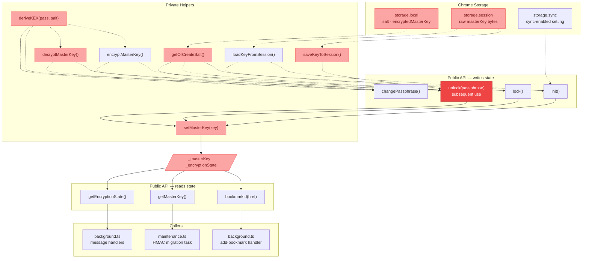
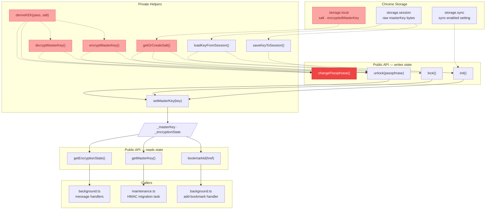

# Overview

Turning on sync enables encryption of the local PouchDB database, and use of encrypted bookmark IDs. This prevents membership attacks against the remote sync database (or the vector databse for that matter)... if an attacker knows a url, and can hash it, they can determine whether it exists in the history even if they cannot access its metadata.

Bookmark IDs are hashed with a master key, a random 256-bit value generated once (on first `unlock()`). It never changes. It's stored in chrome.storage.local encrypted under a key encryption key (KEK).

Generating the master key is done in `unlock()` (rather than in `init()`) because:

a) `init()` runs on every service worker startup, including restarts, and including for users who have never configured encryption/sync.
b) `init()` has no access to the passphrase. The master key needs to be encrypted using the KEK before it can be stored, and the KEK is derived from the passphrase. Without the passphrase there's nothing to wrap the master key with, so it can't be persisted safely.
c) `init()` is read-only with respect to storage. Its job is purely to determine the current state by reading what's already there — it should never create new cryptographic material as a side effect of starting up.

So, generation of the master key is a one-time user-initiated action. The master key should only ever be generated once, the very first time the user explicitly sets up encryption by calling `unlock()` with a new passphrase.

The master key is the stable identity; it never changes. The passphrase (which a user may change) is just an access credential to unlock the master key.

When the user changes (or sets up) their passphrase, we:

1. Derive a new KEK from thenew passphrase + salt
2. Re-encrypt the master key under the new KEK
3. Store the new encrypted master key in storage.local
4. Done

Changing the passphrase doesn't touch any documents; no IDs change.

# State diagram

* The service worker can restart independently of the browser — Chrome can spin it down after ~30 seconds of inactivity and restart it on demand. The service worker's in-memory state is lost on each restart even within the same browser session... we therefore use chrome.storage.session to persist state across restarts (within a session).
* The browser closing is just a special case (of spinning down the service worker) that also clears chrome.storage.session.

* When the browser closes, chrome.storage.session is cleared — so on the next browser start the service worker will find encryptedMasterKey in storage.local (if encryption has been configured) but no session key, and will be in locked state rather than unlocked.
* which is exactly the same situation as the locked self-transition on service worker restart. In other words, a browser close/reopen always lands in locked state.

# Components / Flow diagram(s)

## A call to `init()`

## A call to `lock()`

## A call to `unlock()`

### First call to `unlock()`

- generates a new `masterKey`, encrypts it, stores it.
- `decryptMasterKey()` is not involved.

### Subsequent call to `unlock()`

- decrypts the existing `masterKey`.
- `encryptMasterKey()` is not involved.

## A call to `changePassphrase()`

* no change of state... must be `unlocked`, and remains `unlocked`.

